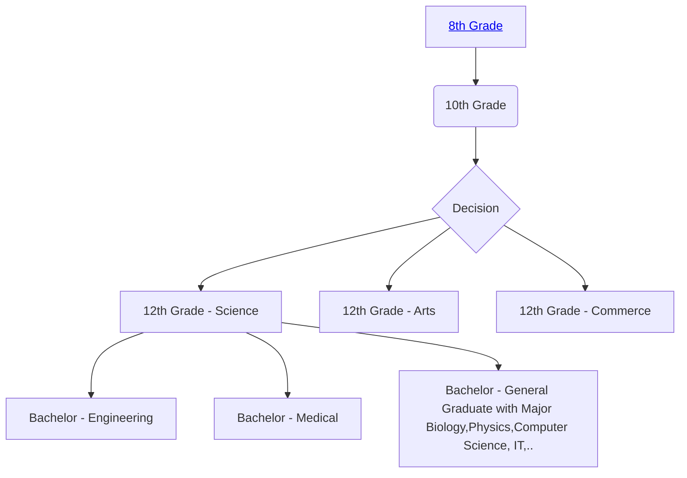

# Introduction
First and foremost, studying is not an easy task. It requires determination, persistence, and hard work. Think of it as a marathon rather than a 100-meter sprint. The internet, being an ocean of information, can provide what you are looking for, but only if you invest significant time and energy. This site has been created to assist and guide students who wish to pursue self-study.

Here is an overview of the typical educational path followed by students from rural areas. Click on the corresponding link to navigate to a specific section.

<section id="8th-grade">
## 8th Grade
If you are studying in 8th grade or below, the primary objective should be to thoroughly understand, internalize, and regularly practice the material being taught in school.

To assess academic progress in comparison to international curricula, students are encouraged to register on [**Khan Academy**](https://www.khanacademy.org/). This will help identify any learning gaps, with support from parents as needed.

</section>

